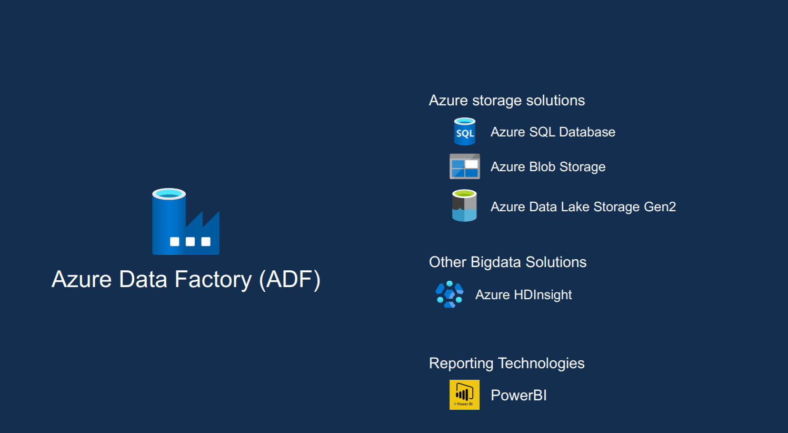

# Project-5 DATA LAKE

Creating a Data Lake and performing some basic visualization 

Basic Architecture :

Overview Project:

### What is ADF?
#### Azure Data Factory (ADF) is a cloud integration system, which allows moving data between on-premises and cloud systems as well as scheduling and orchestrating complex data flows. ADF is more of an Extract-and-Load and Transform-and-Load platform rather than a traditional Extract-Transform-and-Load (ETL) platform.

### ADF

### DATA SOURCE

#### Azure portal page overview:

### What is HDinsight Cluster
#### Azure HDInsight is a cloud distribution of Hadoop components. Azure HDInsight makes it easy, fast, and cost-effective to process massive amounts of data. You can use the most popular open-source frameworks such as Hadoop, Spark, Hive, LLAP, Kafka, Storm, R, and more.

#### Azure DashBoard Overview:

### Hive used in this process.

#### DashBoard where we can have details:

#### Data Sets Info

#### Data flow info

#### Linked Services 

#### Data Flow pipeline

#### List of pipelines

#### Triggers info

#### BI overview:

